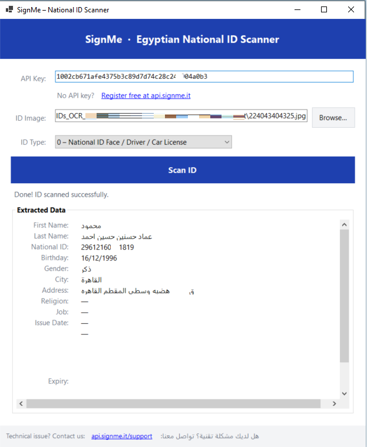

# SignMe – C# Sample App

A minimal Windows Forms application that demonstrates how to use the **SignMe API** to extract data from an Egyptian National ID card image.



## Prerequisites

- [.NET 8 SDK](https://dotnet.microsoft.com/download) (Windows)
- A free SignMe API key → **[Register at api.signme.it](https://api.signme.it)**

## Quick Start

```bash
git clone https://github.com/GoldenDeveloperTec/SignMe-Egypt-National-ID-OCR-API/signme-csharp-sample
cd signme-csharp-sample
dotnet run
```

Or open `SignMeSample.csproj` in **Visual Studio 2022** and press **F5**.

## How it works

1. Enter your API key in the text field at the top.
2. Click **Browse** and select a national ID image (JPG / PNG / BMP).
3. Click **Scan ID**.

Behind the scenes the app:

| Step | Endpoint | Notes |
|------|----------|-------|
| Upload | `POST /uploadImage?ID_type=0` | Returns a job `id` |
| Poll  | `GET /ReadImage?id={id}` | Retried every second, up to 15 s |

When the result is ready, all extracted fields are shown in the **Extracted Data** panel.

## Project structure

```
SignMeSample.csproj   – project file (.NET 8 WinForms)
Program.cs            – entry point
MainForm.cs           – all UI and event logic
ApiClient.cs          – HTTP wrapper (upload + poll)
Models.cs             – JSON record types
```

## API reference

Full Swagger UI: **https://mobapi.signme.it/swagger**

## License

MIT
